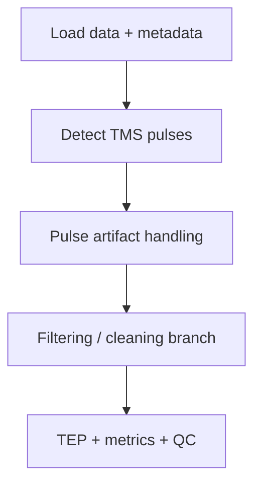

## Recommendation

Add extended article digests and preprocessing pipeline tables, but keep them separate from runtime cards.

Use:

- compact `papers/*.md` cards for fast agent retrieval
- optional extended digests for human/manual depth
- pipeline comparison tables for cross-source decisions

## Extended Digest Location

Put manual long-form digests in:

```text
references/extended-digests/
```

Name them with the same ID as the seed paper card:

```text
papers/wu-2018-artist.md
extended-digests/wu-2018-artist.extended.md
```

The compact paper card should link to the extended digest, not duplicate it.

## Extended Digest Format

```md
---
type: extended-paper-digest
id:
linked_card:
source_pdf:
tags:
---

## One-Screen Summary

## Methods Details

## Preprocessing Parameters

## Validation / Statistics

## Figures And Tables Worth Remembering

## Agent Rules To Promote

## Caveats And Open Questions

## Exact Quotes To Avoid Overusing
```

## Pipeline Table Location

Put structured tables in:

```text
references/pipeline-tables/
```

Recommended first tables:

- `pipeline-comparison-matrix.md`
- `preprocessing-step-order.md`
- `artifact-method-compatibility.md`
- `itep-early-latency-reporting-checklist.md`

## Pipeline Comparison Table Format

```md
---
type: pipeline-table
id: pipeline-comparison-matrix
tags:
  - pipeline:mne
  - pipeline:tesa-inspired
  - pipeline:artist-aaratep
  - pipeline:sound-ssp-sir
---

| Pipeline | Ecosystem | Best for | Key steps | Strengths | Risks | Must-load cards |
|---|---|---|---|---|---|---|
```

## Diagram Guidance

Use Mermaid diagrams for flowcharts when the sequence matters:



Keep diagrams short. The agent should use them for workflow orientation, not as the only source of decisions.

## Agent Loading Rule

Load extended digests only when:

- the user asks for detailed literature reasoning
- a compact card says a claim needs full-methods support
- comparing paper-specific parameters
- extracting exact preprocessing windows, thresholds, or validation results

Otherwise prefer compact cards and tables.
