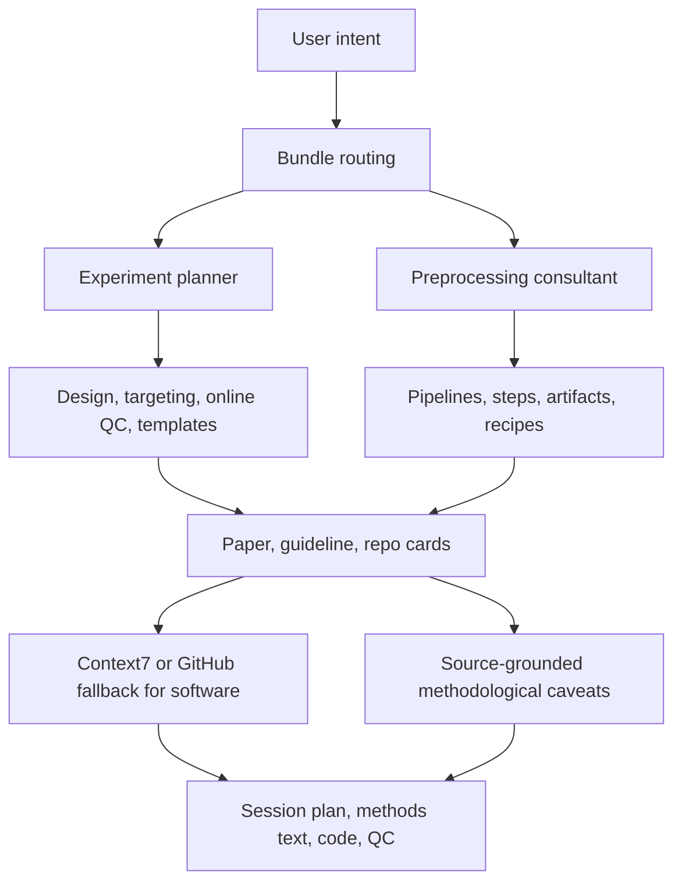
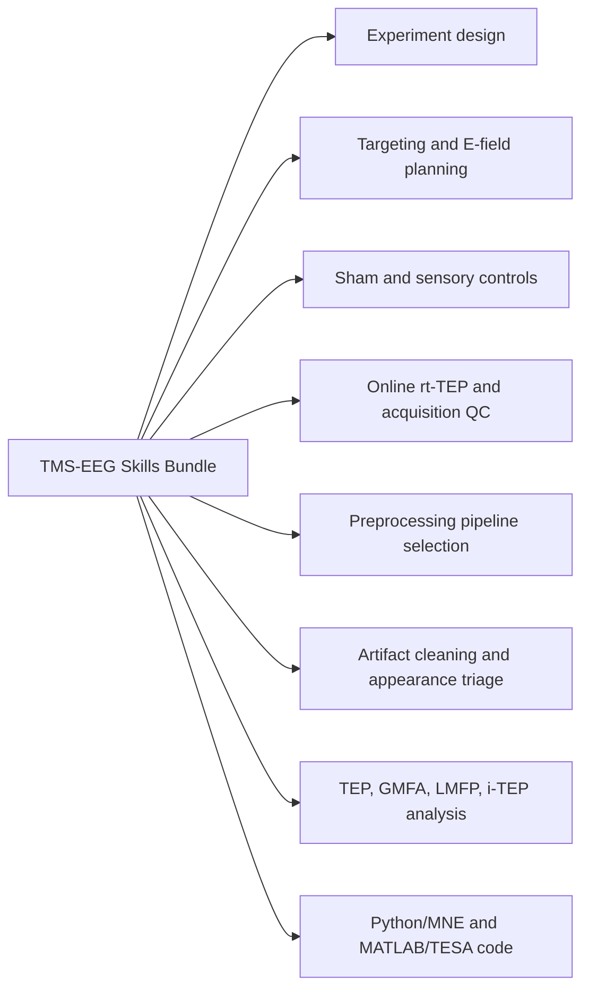
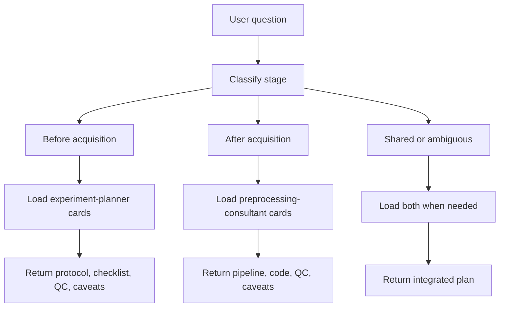

# TMS-EEG Skills Bundle

## Bundle Structure

```text
tms-eeg-skills-bundle/
├── README.md
├── assets/
│   └── diagrams/
│       ├── bundle-structure.svg
│       ├── bundle-knowledge-layers.svg
│       ├── bundle-functional-branches.svg
│       ├── bundle-runtime-block-logic.svg
│       └── bundle-lifecycle-routing.svg
├── tms-eeg-experiment-planner/        # before acquisition
│   ├── SKILL.md
│   ├── references/
│   │   ├── routing/              (2)
│   │   ├── design/               (5)
│   │   ├── targeting/            (3)
│   │   ├── targets/              (6)
│   │   ├── online-qc/            (3)
│   │   ├── artifacts/            (2)
│   │   ├── artifact-appearance/  (3)
│   │   ├── repos/                (5)
│   │   ├── papers/              (13)
│   │   └── guidelines/           (2)
│   └── templates/                (3)
└── tms-eeg-preprocessing-consultant/  # after acquisition
    ├── SKILL.md
    ├── references/
    │   ├── routing/              (5)
    │   ├── pipelines/            (6)
    │   ├── steps/               (23)
    │   ├── artifacts/           (10)
    │   ├── repos/                (7)
    │   ├── papers/              (33)
    │   ├── guidelines/           (2)
    │   ├── extended-digests/     (2)
    │   └── pipeline-tables/      (3)
    ├── recipes/                 (10)
    └── assets/
```

Card counts are approximate and grow as the corpus expands.

SVG version: `bundle-structure.svg`

## Short Description

The `tms-eeg-skills-bundle` is a modular AI-agent knowledge system for TMS-EEG work across the full study lifecycle. It keeps pre-acquisition experiment planning and post-acquisition preprocessing as separate sub-skills, while preserving a shared methodological logic: source-grounded cards, explicit routing, artifact-aware caveats, software lookup policies, and practical templates.

## Knowledge Layers



SVG version: `bundle-knowledge-layers.svg`

## Functional Branches



SVG version: `bundle-functional-branches.svg`

## Runtime Block Logic



SVG version: `bundle-runtime-block-logic.svg`

## Design Principle

The bundle separates the lifecycle of TMS-EEG work into two agent states:

| State | Sub-skill | Main Question |
|---|---|---|
| Before acquisition | `tms-eeg-experiment-planner` | How do we design the session so the data can answer the question? |
| After acquisition | `tms-eeg-preprocessing-consultant` | How do we clean, quantify, code, and interpret the acquired data cautiously? |

This division prevents a common failure mode: treating preprocessing as a rescue operation for avoidable acquisition problems. The planner emphasizes target choice, coil orientation, stimulation intensity, sham/control design, online rt-TEP monitoring, channel preparation, and artifact prevention. The preprocessing consultant emphasizes pipeline choice, pulse/decay/muscle/sensory artifact handling, TEP/GMFA/LMFP/i-TEP computation, code generation, and QC reporting.

## Shared Methodological Rules

- Do not treat RMT or fixed percent RMT as sufficient for non-motor TMS-EEG dosing.
- Do not treat TEP, GMFA, LMFP, or i-TEP amplitude as pure cortical excitability.
- Do not assume preprocessing can recover data dominated by acquisition artifacts.
- For early and immediate TEPs, explicitly separate TMS-pulse artifact, decay/back-to-baseline recovery, muscle artifact, lead configuration, sampling frequency, synchronization, and controls.
- For software-specific code, use Context7 first when available; otherwise inspect the official or GitHub fallback source.
- Prefer compact cards and templates at runtime; keep raw articles as provenance rather than primary runtime context.

## One-Sentence Summary

The TMS-EEG skills bundle turns experiment-planning knowledge, preprocessing workflows, artifact diagnostics, software ecosystems, and methodological literature into a routed AI-agent expert system for designing and analyzing TMS-EEG studies with explicit caveats.
