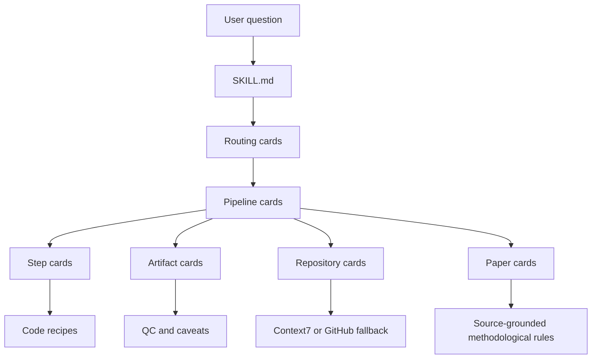
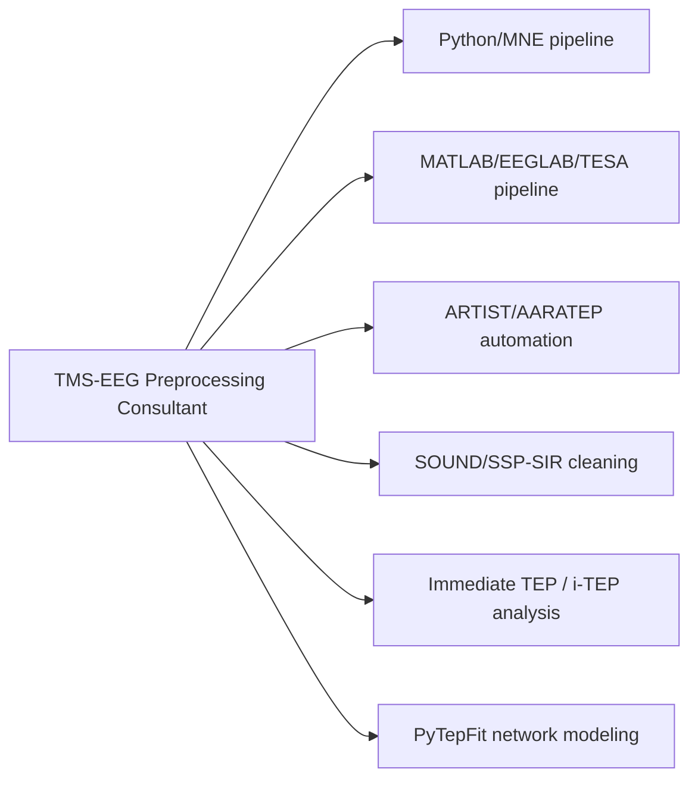
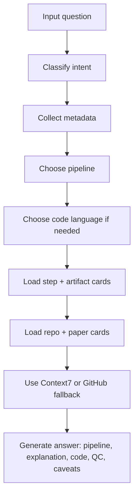

# Article-Ready Scheme

## Skill Structure

```text
tms-eeg-skills-bundle/
└── tms-eeg-preprocessing-consultant/
├── SKILL.md
├── recipes/
│   ├── Python/MNE templates
│   │   ├── load_mne_data.md
│   │   ├── detect_tms_events.md
│   │   ├── interpolate_pulse_artifact.md
│   │   ├── run_ica_with_qc.md
│   │   ├── compute_teps_gmfa_lmfp.md
│   │   ├── itep_early_window_analysis.md
│   │   └── qc_report.md
│   ├── MATLAB/EEGLAB/TESA templates
│   │   ├── tesa_matlab_preprocessing.md
│   │   └── aaratep_matlab_skeleton.md
│   └── Model-analysis templates
│       └── pytepfit_source_inspection.md
└── references/
    ├── routing/
    │   ├── question-routing.md
    │   ├── code-language-selection.md
    │   ├── context7-or-github-fallback.md
    │   ├── tag-index.md
    │   └── manual-digests-and-pipeline-tables.md
    ├── pipelines/
    │   ├── conservative-mne-python.md
    │   ├── tesa-inspired-two-pass-ica.md
    │   ├── automated-artist-aaratep.md
    │   ├── sound-ssp-sir-enhanced.md
    │   ├── itep-early-response-analysis.md
    │   └── tepfit-network-modeling-analysis.md
    ├── steps/
    │   ├── data-intake-and-metadata.md
    │   ├── tms-pulse-detection.md
    │   ├── pulse-artifact-removal-or-interpolation.md
    │   ├── bad-channel-detection-and-interpolation.md
    │   ├── filtering.md
    │   ├── ica-component-rejection.md
    │   ├── sound-cleaning.md
    │   ├── ssp-sir-cleaning.md
    │   ├── tep-averaging.md
    │   ├── gmfa-lmfp-computation.md
    │   ├── itep-analysis-window-selection.md
    │   └── qc-plots-and-reporting.md
    ├── artifacts/
    │   ├── pulse-artifact.md
    │   ├── muscle-artifact.md
    │   ├── auditory-somatosensory-confounds.md
    │   ├── overcleaning-and-ica-risk.md
    │   ├── lead-configuration-early-artifacts.md
    │   └── sampling-sync-early-artifacts.md
    ├── repos/
    │   ├── mne-python.md
    │   ├── tmseegpy.md
    │   ├── tesa.md
    │   ├── aaratep-pipeline.md
    │   ├── pytep-sound-ssp-sir.md
    │   ├── pytepfit.md
    │   └── simnibs.md
    ├── papers/
    │   ├── compact source cards
    │   └── new-articles-index.md
    ├── guidelines/
    │   ├── recommendations-good-practice.md
    │   └── matlab-tesa-lesson-pipeline.md
    ├── extended-digests/
    │   ├── index.md
    │   └── _template.extended.md
    └── pipeline-tables/
        ├── index.md
        └── _template.pipeline-table.md
```

## Short Description

`tms-eeg-preprocessing-consultant` is a modular AI-agent skill for TMS-EEG preprocessing, TEP analysis, and artifact-aware methodological reasoning. It helps an agent select an appropriate preprocessing workflow, explain each step, generate cautious Python/MNE or MATLAB/EEGLAB/TESA code, and discuss analysis branches such as i-TEPs, SOUND/SSP-SIR, ARTIST/AARATEP, and PyTepFit.

The skill does not use raw articles directly at runtime. Instead, articles, repositories, and local methodology notes are distilled into compact Markdown cards that encode source-grounded rules, caveats, workflows, and code templates.

## Knowledge Layers



SVG version: `knowledge-layers.svg`

## Functional Branches



SVG version: `functional-branches.svg`

## Runtime Logic



SVG version: `runtime-logic.svg`

## Design Principle

The skill separates four kinds of knowledge:

| Layer | Role |
|---|---|
| Pipeline cards | Choose the overall workflow |
| Step cards | Explain and implement reusable preprocessing operations |
| Artifact cards | Prevent unsafe interpretation and overconfident claims |
| Paper/repo cards | Ground advice in literature and software sources |

This separation allows progressive disclosure. The agent first loads only the small routing and pipeline cards, then selectively opens detailed step, artifact, repo, or paper cards when the user's question requires them.

The same structure supports two response modes:

| Mode | Behavior |
|---|---|
| Learning mode | Explains why each preprocessing step matters and what can go wrong |
| Code-engineer mode | Produces concise Python or MATLAB templates with placeholders and QC checks |

## Core Methodological Rules

- TEP, GMFA, LMFP, and i-TEP amplitudes must not be treated as pure cortical excitability.
- Early i-TEP analysis must address residual pulse artifact, lead configuration, sampling/synchronization, muscle artifact, and control conditions.
- ICA, SOUND, SSP-SIR, ARTIST, and AARATEP outputs must not be treated as automatically artifact-free.
- MATLAB/TESA and Python/MNE code paths must be selected explicitly when possible.
- Function signatures should not be invented; the agent must use Context7 or GitHub fallback for current software details.
- PyTepFit is treated as downstream model-based TEP analysis, not preprocessing.

## One-Sentence Summary

The skill transforms TMS-EEG articles, repositories, and methodological notes into a structured operational knowledge system that lets an AI agent behave like a cautious TMS-EEG preprocessing and analysis consultant.
